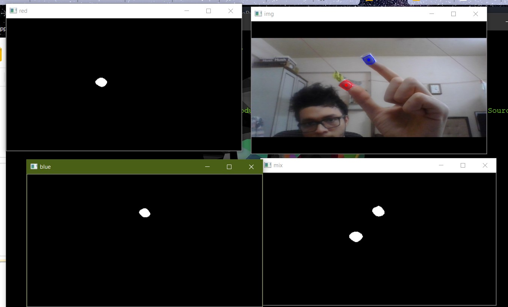

# Gesture Controlled Mouse using OpenCV

A mouse that detects the position and orientation of your fingers using image processing, and then positions the mouse on the screen accordingly.

<!-- TABLE OF CONTENTS -->

## Table of Contents

- [About the Project](#about-the-project)
  - [Tech Stack](#tech-stack)
  - [File Structure](#file-structure)
- [Getting Started](#getting-started)
  - [Prerequisites](#prerequisites)
  - [Installation](#installation)
- [Usage](#usage)
- [Future Work](#future-work)
- [Contributors](#contributors)
- [Acknowledgements](#acknowledgements)
- [License](#license)

<!-- ABOUT THE PROJECT -->

## About The Project



Aim and Description of project.  
Refer this [documentation](https://drive.google.com/file/d/1jPo3_0TGM8b9NZWqUmkB7iy4CfzowOmz/view?usp=sharing)

### Tech Stack

This section should list the technologies you used for this project. Leave any add-ons/plugins for the prerequisite section. Here are a few examples.

- [OpenCV](https://opencv.org/)

### File Structure

```bash
+
|
|
+---+trials
|    +
|    +--+background removal.ipynb
|    |
|    +--+change detection.ipynb
|    |
|    +--+color detector.ipynb
|    |
|    +--+finger-cascade.xml
|    |
|    +--+Hand detection.ipynb
|    |
|    +--+mouse final.ipynb
|    |
|    +--+mouse.ipynb
|
+---+final.py
|
+---+README.md
|
+---+requirements.txt
```

<!-- GETTING STARTED -->

## Getting Started

### Prerequisites

- Python 3.5 and above

### Installation

1. Clone the repo

```sh
git clone https://github.com/kkothari2001/Gesture-Mouse-using-OpenCV
```

2. Install the requirements

```sh
pip install -r "requirements.txt"
```

<!-- USAGE EXAMPLES -->

## Usage

```sh
python final.py
```

<!-- FUTURE WORK -->

## Future Work

- [ ] Implement using ConvNets

<!-- TROUBLESHOOTING -->

<!-- CONTRIBUTORS -->

## Contributors

- [Kush Kothari](https://github.com/kkothari2001)

<!-- ACKNOWLEDGEMENTS AND REFERENCES -->

## Acknowledgements

- [SRA VJTI](http://sra.vjti.info/) Eklavya 2020
- [Vedant Paranjape](https://github.com/VedantParanjape)
- [Sravan Chittupalli](https://github.com/SravanChittupalli)

<!-- LICENSE -->

## License

Describe your [License](LICENSE) for your project.
